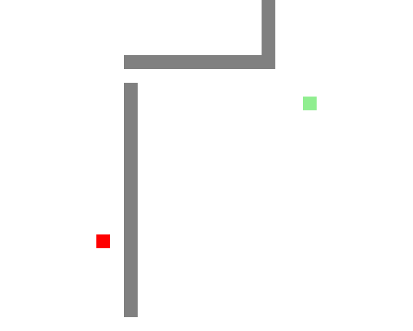
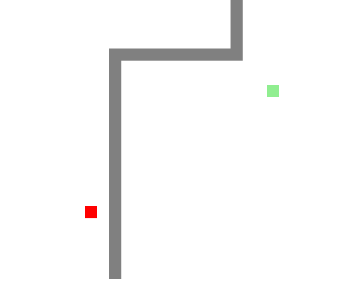
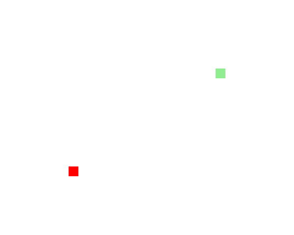

# Path finding using A-Star algorithm

- Simple python implementation
- Comparison of Dijkstra's algorithm (left) with A-star (right)

## Example 1

    
    

## Example 2

    
    

## Example 3

    
    

## Example 4

    
    

